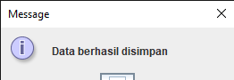

<h1>penggunbakan konsep mvc</h1>

-----------------
Workspace ini berisi kode Java yang digunakan untuk membuat aplikasi CRUD (Create, Read, Update, Delete) untuk data mahasiswa dan nilai. Aplikasi ini menggunakan framework Swing untuk antarmuka pengguna dan database MySQL untuk penyimpanan data.

## Struktur Folder
-----------------

* **src**: folder yang berisi kode Java
* **lib**: folder yang berisi dependensi library
* **bin**: folder yang berisi file hasil kompilasi

## Kode Java
-------------

### Model

* **Mahasiswa.java**: model data mahasiswa
* **Nilai.java**: model data nilai
* **MahasiswaModel.java**: model untuk mengelola data mahasiswa
* **NilaiModel.java**: model untuk mengelola data nilai

### Controller

* **MahasiswaController.java**: controller untuk mengelola data mahasiswa
* **NilaiController.java**: controller untuk mengelola data nilai

### View

* **FormMahasiswa.java**: form untuk mengelola data mahasiswa
* **FormNilai.java**: form untuk mengelola data nilai

### Classes

* **Database.java**: kelas untuk mengelola koneksi database
* **BaseModel.java**: kelas dasar untuk model data
* **RowMapper.java**: interface untuk mapping data dari database ke model

### Main

* **Main.java**: kelas utama untuk menjalankan aplikasi

## Fungsi Kode
--------------

* **MahasiswaController.java** dan **NilaiController.java** digunakan untuk mengelola data mahasiswa dan nilai, termasuk CRUD operasi.
* **FormMahasiswa.java** dan **FormNilai.java** digunakan untuk menampilkan antarmuka pengguna untuk mengelola data mahasiswa dan nilai.
* **MahasiswaModel.java** dan **NilaiModel.java** digunakan untuk mengelola data mahasiswa dan nilai, termasuk CRUD operasi.
* **Database.java** digunakan untuk mengelola koneksi database.
* **BaseModel.java** digunakan sebagai kelas dasar untuk model data.
* **RowMapper.java** digunakan untuk mapping data dari database ke model.

